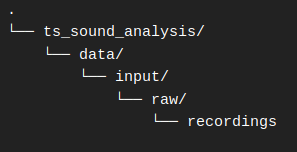

# This project

## Intro

This repository contains code that allows you to compute acoustic indices using a long (\> 2 mins.) audio recording. The target group in mind are volunteers working at Terra Sylvestris. They will typically record audio twice a day during 30 minutes at field stations in different locations on the island of Kalamos.

The specific problem that this piece of software solves is the following: the R libraries [soundecology](https://ljvillanueva.github.io/soundecology/ "R library: soundecology") and [seawave](https://jeromeecoac.r-universe.dev/seewave "R library: seawave") are commonly used in order to compute sound indices. However, many times in the past, volunteers noticed that these routines would result in NA values or even errors while analysing their samples. After careful examination, it seems that these packages work best with one-minute long audio recordings as an input. What this routine does is:

1.  It splits an n-minute long audio file in n one-minute long audio files

2.  It computes sound indices using the soundecology and seawave packages

3.  It outputs the results to a csv file that volunteers can then analyse

4.  The routine is written in such a way that multiple files can be analysed one after the other, reducing manual work.

## The acoustic indices

The soundecology library is used compute the following 4 indices:

-   Acoustic complexity, as discussed in [Pieretti, 2011](https://www.sciencedirect.com/science/article/abs/pii/S1470160X10002037 "ACI")

-   Acoustic diversity, as discussed in [Villanueva-Rivera, 2011](https://link.springer.com/article/10.1007/s10980-011-9636-9 "ADI")

-   Acoustic evenness, as discussed in [Villanueva-Rivera, 2011](https://link.springer.com/article/10.1007/s10980-011-9636-9 "ADI")

-   Bioacoustic index, as discussed in [Boelman, 2007](https://esajournals.onlinelibrary.wiley.com/doi/abs/10.1890/07-0004.1 "BIO")

The following two indices are computed using the seawave package:

-   Entropy H,

-   Normalised Diffrence Snow Index (NDSI)

In the case of H, as well as the first four indices, the *multiple_sounds()* function in soundecology is used in order to leverage the power of parallel computing. Soundecology calls seawave under the hood when computing H.\
\
In the case of NDSI, the routine explicitely calls seawave even though the soundecology also has an NDSI-function. It has been observed, however, that the soundecology function more often results in NA values. Calling seawave directly more often yields a result.

## Running the routine

Here are the steps you need to follow in order to analyse data. The assumption is that you are all set up. Below, there is a section that specifically delves into the set-up.

### Prepare your audio files

The routine expects a .wav file. Be sure you use .aav files as an input.

Additionally, it is essential that the filename has a the following pattern:

[field station] \_ [year] \_ [month] \_ [day] \_ [free text] .wav

Here two valid examples:

F3.1_2021_11_02_0744-morning.wav

F4.2_2024_10_21.wav

### Place your files in the input folder

Place all your .wav files within the recordings/ folder.

### Run it!

Open the file *bulk_analysis.R.* Hit the source button.

The default name of the output is "acoustic_indices.csv" and it will be written to the data/output/ folder. You can change the name of the output file if you wish.

## Set up

In order to be able to run this script you need to:

1.  have R and RStudio installed on your device. Download and install both [here](https://posit.co/download/rstudio-desktop/ "R/RStudio").

2.  clone this repository to any location of your choice on your device. Cloning of repositories, you do with *git.* Download and install git [here](https://git-scm.com/downloads "Git downloads").

3.  install the necessary dependencies using *renv*. This is the tool R uses to manage virtual environments. This repository uses a virtual environment so you needn't install any packages directly on your system. Once the Rproject ts_sound_analysis is open, head to the console and excute `renv::install()`
